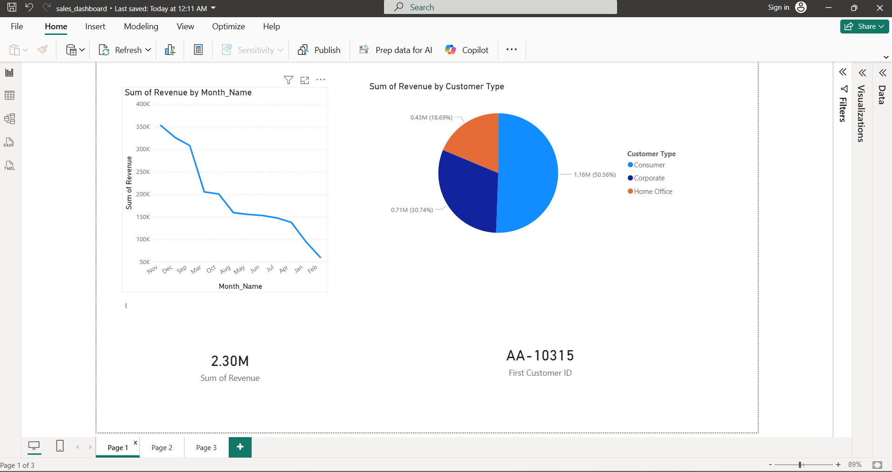
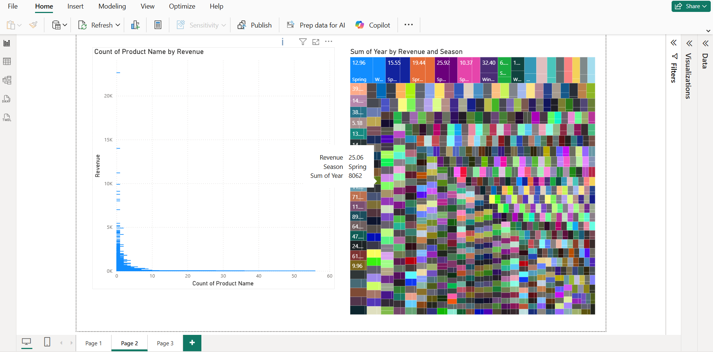

# Sales Analytics Project

**Repository:** https://github.com/Mahdeen52/sales_analytics_project

## Project Description

The Sales Analytics Project is a comprehensive analysis of sales data aimed at helping businesses understand performance, uncover trends and make data-driven decisions. The project covers the entire data analysis workflow, from data collection and cleaning to visualization and reporting. 

Key aspects of the project include:

- **Data Cleaning and Preparation:** Raw sales data is preprocessed to handle missing values, correct inconsistencies, and standardize formats to ensure accuracy for analysis.
- **Exploratory Data Analysis (EDA):** Statistical summaries and visualizations are created to identify patterns, trends, and outliers in the sales data.
- **Sales Performance Analysis:** Insights into total sales, product performance, regional sales, and seasonal trends are derived to help inform business decisions.
- **Visualization and Reporting:** Interactive and static visualizations, such as charts and dashboards, are generated to clearly communicate insights.
- **Scalable and Modular Code:** Python scripts and Jupyter notebooks are organized to allow easy extension and reuse for future analysis or similar datasets.

This project is suitable for business analysts, data scientists, and stakeholders looking to gain a clear understanding of sales trends and customer behavior through structured data analysis.

## Project Structure

sales_analytics_project/
├── data/ # Raw and processed sales data
├── notebooks/ # Jupyter notebooks for EDA and modeling
├── src/ # Python scripts for data processing and visualization
├── reports/ # Generated charts and summary reports
├── requirements.txt # Project dependencies
└── README.md

## Objectives

1. Analyze sales trends over time and across different regions.
2. Identify top-performing products and categories.
3. Measure customer behavior and purchase patterns.
4. Provide actionable insights through visualizations and reports.

## Technologies Used

- Python
- pandas, numpy
- matplotlib, seaborn
- Jupyter Notebook

## Getting Started

1. Clone the repository:

bash
git clone https://github.com/Mahdeen52/sales_analytics_project.git
cd sales_analytics_project

2.    Install dependencies:

pip install -r requirements.txt

3.   Run the Jupyter notebooks or Python scripts to reproduce the analysis

## Project Screenshots

### Sales Dashboard

